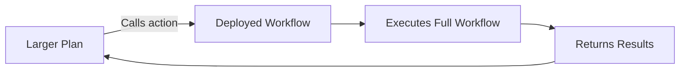

## Workflows as Building Blocks

Action triggers let you deploy a workflow as a **reusable action** that Maia can automatically call and execute as part of larger, more sophisticated operations. Instead of rebuilding the same logic across multiple plans, you build it once and Maia uses it wherever it's needed.

<Note>
  With action triggers, your workflows become a **library of high-performance tools** that Maia orchestrates automatically — turning custom logic into modular building blocks.
</Note>

## How Action Triggers Work

When you enable an action trigger on a deployed workflow, Maia registers it as an available action — just like actions from connections, custom platforms, and data sources. Maia can then discover and call it during planning and execution whenever it's relevant.



### Enabling an Action Trigger

<Steps>
  <Step title="Deploy Your Workflow">
    Build and deploy your workflow, or open an existing deployed workflow.
  </Step>

  <Step title="Enable the Action Trigger">
    Every deployed workflow comes with an action trigger. In the trigger management section, toggle it on. Maia automatically generates an action name based on your workflow's title, and the workflow becomes available as an action that Maia can call.
  </Step>
</Steps>

## What Makes This Powerful

### Composability

Maia can combine multiple workflow actions together to solve complex, multi-step problems. Each workflow action is a self-contained unit that Maia calls as needed, just like any other action in its toolkit.

### Automatic Discovery

You don't need to explicitly tell Maia which workflow actions to use. During planning, Maia discovers relevant actions based on their names and descriptions and incorporates them into its strategy automatically.

### Modular Scalability

Since each building block is consistent and editable on its own, you can improve a single workflow action and instantly upgrade every complex plan that relies on it — without modifying the plans themselves.

## Use Cases

<AccordionGroup>
  <Accordion title="Automated Lead Scoring" icon="chart-simple">
    Build a "Lead Scoring" workflow that evaluates prospects based on your exact criteria. Once deployed as an action, Maia calls it as a step within larger flows — like a full lead generation pipeline or a multi-touch warm-up sequence — scoring each lead in context without you lifting a finger.
    
    **Example flow:**
    ```
    Lead Generation Pipeline
    ├── Scrape leads from target websites
    ├── → Call "Lead Scoring" action for each lead
    ├── Filter leads with score > 70
    ├── Enrich high-scoring leads with LinkedIn data
    └── Add qualified leads to CRM
    ```
  </Accordion>

  <Accordion title="On-Brand Image Generation" icon="image">
    Define your brand's visual identity once in a "Brand Image Generator" workflow. Maia calls it whenever visuals are needed across larger content or campaign flows — ensuring every generated image stays consistent with your brand, automatically.
    
    **Example flow:**
    ```
    Content Campaign Builder
    ├── Generate blog post from topic brief
    ├── → Call "Brand Image Generator" for hero image
    ├── → Call "Brand Image Generator" for social thumbnails
    ├── Format for website publication
    └── Schedule social media posts
    ```
  </Accordion>

  <Accordion title="Custom Data Processing" icon="gears">
    Package specialized data processing — like cleaning, validation, or transformation — into a workflow action. Any plan that handles raw data can call your processing workflow to apply consistent standards.
    
    **Example flow:**
    ```
    Monthly Reporting Pipeline
    ├── Pull raw data from multiple sources
    ├── → Call "Data Cleaner" action on each dataset
    ├── Merge cleaned datasets
    ├── Generate charts and analysis
    └── Create PDF report and distribute
    ```
  </Accordion>

  <Accordion title="Compliance Review" icon="shield-check">
    Create a compliance-checking workflow that reviews content against your policies. Maia can call it wherever content is generated — emails, reports, social posts — ensuring everything meets your standards before delivery.
    
    **Example flow:**
    ```
    Client Communication Flow
    ├── Draft response based on client inquiry
    ├── → Call "Compliance Review" action on draft
    ├── Apply recommended changes
    └── Send approved response
    ```
  </Accordion>
</AccordionGroup>

## Combining with Other Triggers

Action triggers work alongside routine and webhook triggers on the same workflow. For example, a lead scoring workflow could:

- **Action trigger**: Maia calls it within a larger lead generation plan
- **Webhook trigger**: Your website form calls it directly for real-time scoring
- **Routine trigger**: It runs every morning to re-score yesterday's leads with updated data

All three triggers execute the same workflow, keeping your scoring logic consistent across every entry point.

<Card title="Next: Webhook Triggers" icon="webhook" href="/workflows/webhook-triggers">
  Trigger workflows from external events and return intelligent responses
</Card>
