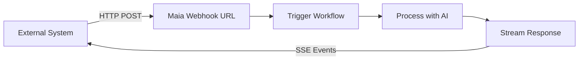

## Event-Driven Automation

Webhook triggers turn deployed workflows into **intelligent APIs** that respond to external events — form submissions, payment notifications, chat messages, and more.

<Note>
  With webhook triggers, Maia becomes a **serverless backend** that processes inbound requests with AI-powered logic and returns structured responses.
</Note>

## How Webhook Triggers Work



### Basic Flow

<Steps>
  <Step title="Add Webhook Trigger">
    From your deployed workflow's detail page, click the **Add Trigger** button and select **Webhook**.
    
    Maia generates a unique URL:
    ```
    https://hooks.modularmind.app/hooks/0nMMaZgKjmOirqosc8ohkeCuw9cV
    ```
  </Step>
  
  <Step title="External Event">
    Another system sends data to your webhook URL
    
    ```bash
    curl -X POST https://hooks.modularmind.app/hooks/0nMMaZgKjmOirqosc8ohkeCuw9cV \
      -H "Content-Type: application/json" \
      -d '{"email": "john@example.com", "message": "Interested in demo"}'
    ```
  </Step>
  
  <Step title="Maia Processes">
    Your workflow receives the payload and executes
    
    - Parse incoming data
    - Run AI analysis, research, or generation
    - Use actions
  </Step>
  
  <Step title="Stream Response">
    Maia streams back the result via SSE events

    ```
    event: response
    data: {"status":200,"contentType":"application/json","body":"{\"lead_score\":85,\"recommendation\":\"High priority - schedule demo ASAP\"}"}

    event: done
    data: {}
    ```
  </Step>
</Steps>

## Creating Webhook-Triggered Workflows

### Simple Example: Lead Enrichment

**Goal:** When a contact form is submitted, enrich the lead data before adding to CRM.

**Workflow:**
```
1. Receive form data (name, email, company)
2. Research company online (industry, size, funding)
3. Check LinkedIn for person's role
4. Calculate lead score (1-100)
5. Add to CRM with enriched data
6. Return lead score and priority
```

**Webhook URL:**
```
Maia provides: https://hooks.modularmind.app/hooks/L3wKjb7iEMFTwMJFZsroWsSoc731
```

**Usage:**
Your website form submits to this URL and receives an SSE stream. Once complete, the parsed response body contains:
```json
{
  "lead_id": "CRM_12345",
  "score": 92,
  "priority": "hot",
  "reason": "Decision maker at Series B SaaS company"
}
```

## Inbound Payload: Flexible Schema

Unlike traditional APIs that require strict schemas, Maia webhooks are **intelligent**.

### Maia Understands Context

Send any data format, and Maia figures it out:

<Tabs>
  <Tab title="JSON Object">
    ```json
    {
      "customer_email": "jane@example.com",
      "subject": "Need help with billing",
      "message": "I was charged twice this month"
    }
    ```
    
    **Maia extracts:**
    - Email: jane@example.com
    - Subject: Billing issue
    - Problem: Double charge
  </Tab>
  
  <Tab title="Form Data">
    ```
    email=jane@example.com&subject=billing&message=charged+twice
    ```
    
    **Maia converts** to structured format automatically
  </Tab>
  
  <Tab title="File Upload">
    ```
    Content-Type: multipart/form-data
    
    file: invoice.pdf
    description: "Please process this invoice"
    ```
    
    **Maia receives** file, extracts data
  </Tab>
  
  <Tab title="Image Upload">
    ```
    Content-Type: multipart/form-data
    
    file: screenshot.png
    description: "Analyze this image"
    ```
    
    **Maia detects and processes** JPEG/PNG images automatically
  </Tab>
  
  <Tab title="Multiple Files">
    ```
    Content-Type: multipart/form-data
    
    file1: contract.pdf
    file2: receipt.jpg
    file3: notes.txt
    description: "Process all these documents"
    ```
    
    **Maia handles** multiple files in a single request
  </Tab>
  
  <Tab title="Files in JSON">
    ```json
    {
      "invoice": {
        "filename": "invoice.pdf",
        "content": "base64EncodedData...",
        "encoding": "base64"
      },
      "supporting_docs": [
        {
          "filename": "receipt.jpg",
          "data": "binaryData..."
        }
      ]
    }
    ```
    
    **Maia processes** files embedded in JSON (base64 or raw binary)
  </Tab>
  
  <Tab title="ZIP Archive">
    ```
    Content-Type: multipart/form-data
    
    file: documents.zip
    instructions: "Extract and analyze all contents"
    ```
    
    **Maia automatically extracts** ZIP files and processes contents (PDFs, images, text files)
  </Tab>
  
  <Tab title="Complex JSON">
    ```json
    {
      "order_id": "12345",
      "customer": {
        "name": "John Doe",
        "contact": {
          "email": "john@example.com"
        }
      },
      "items": [
        {"product": "Widget", "qty": 5}
      ],
      "attachments": {
        "receipt": "base64Data..."
      }
    }
    ```
    
    **Maia understands** arbitrary nested JSON structures
  </Tab>
</Tabs>

## Outbound Response: Controlling What Gets Returned

When adding a webhook trigger, you choose how Maia responds to incoming requests.

### Default Response (Immediate)

If you don't enable **"Respond to webhook with data"**, Maia returns immediately with one of these standard responses:

**Success:**
```json
{
  "type": "success",
  "message": "Workflow execution triggered successfully."
}
```

**Error (Invalid Endpoint):**
```json
{
  "type": "error",
  "code": "invalid_endpoint",
  "message": "Invalid endpoint. Please check the path and try again."
}
```

**Error (Disabled Endpoint):**
```json
{
  "type": "error",
  "code": "endpoint_disabled",
  "message": "This endpoint is currently disabled."
}
```

The workflow executes asynchronously, but the caller doesn't wait for results.

### Custom Data Response (SSE Streaming)

Enable **"Respond to webhook with data"** to return workflow outputs back to the caller via **Server-Sent Events (SSE)**.

<Frame> </Frame>

When enabled, you define **Body Parameters** — exactly like configuring [Custom Actions](/integrations/custom-actions). This tells Maia what data to include in the response.

<Note>
  Maia uses SSE streaming instead of a standard JSON response. This keeps the connection alive while the workflow executes, preventing timeouts on long-running workflows.
</Note>

#### Connection Protocol

When a webhook trigger with response data enabled receives a request, the connection follows this lifecycle:

<Steps>
  <Step title="SSE Connection Established">
    The server responds with `200 OK` and SSE headers:
    ```
    Content-Type: text/event-stream
    Cache-Control: no-cache
    Connection: keep-alive
    ```
  </Step>

  <Step title="Heartbeats During Processing">
    While the workflow executes, the server sends periodic heartbeat comments every 15 seconds to keep the connection alive:
    ```
    : heartbeat
    ```
    These are SSE comments and should be ignored by your client.
  </Step>

  <Step title="Response Event">
    When the workflow completes, the server sends a `response` event containing the result:
    ```
    event: response
    data: {"status":200,"contentType":"application/json","body":"{...}"}
    ```

    For text-based responses (`application/json`, `text/*`), the `body` field contains the raw string. For binary responses (images, PDFs, ZIPs), the `body` is base64-encoded and an `encoding: "base64"` field is included.
  </Step>

  <Step title="Done Event">
    A `done` event signals the stream is complete:
    ```
    event: done
    data: {}
    ```
    The connection closes after this event.
  </Step>
</Steps>

#### Error Handling

If the workflow fails to trigger, the server sends an `error` event instead:
```
event: error
data: {"type":"workflow_trigger_failed","message":"Failed to trigger workflow execution."}
```

#### Client Implementation Example

```javascript
const eventSource = new EventSource('https://hooks.modularmind.app/hooks/your_hook_id', {
  method: 'POST',
  headers: { 'Content-Type': 'application/json' },
  body: JSON.stringify({ email: 'john@example.com' })
});

// Note: EventSource only supports GET requests.
// For POST requests, use fetch with a manual SSE parser:

const response = await fetch('https://hooks.modularmind.app/hooks/your_hook_id', {
  method: 'POST',
  headers: { 'Content-Type': 'application/json' },
  body: JSON.stringify({ email: 'john@example.com' })
});

const reader = response.body.getReader();
const decoder = new TextDecoder();

while (true) {
  const { done, value } = await reader.read();
  if (done) break;

  const text = decoder.decode(value);
  const lines = text.split('\n');

  for (const line of lines) {
    if (line.startsWith('event: ')) {
      const eventName = line.slice(7);
      // Next data: line contains the payload
    }
    if (line.startsWith('data: ')) {
      const data = JSON.parse(line.slice(6));
      // Handle event data
    }
  }
}
```

#### Supported Response Types

Maia can return:
- **Text data in JSON format** (structured responses) — delivered as-is in the `body` field
- **Images** (JPEG, PNG) — base64-encoded in the `body` field with `encoding: "base64"`
- **Text files** — delivered as-is in the `body` field
- **PDFs** — base64-encoded in the `body` field with `encoding: "base64"`
- **ZIP files** — base64-encoded in the `body` field with `encoding: "base64"`

Data, including files, can be generated throughout the workflow or downloaded from external sources.

#### Defining Response Parameters

For each parameter you want to return, specify:

**Name**: The field name in the response (e.g., `lead_score`, `generated_image`, `report_pdf`)

**Description**: Natural language explanation of what this field contains and where Maia should get the value from. This helps Maia understand which workflow outputs map to this response field.

**Type**: The type of data (text, file, etc.)

<Note>
  Response parameter definitions work identically to body parameters in [Custom Actions](/integrations/custom-actions#body-parameters). See that section for detailed parameter configuration guidance.
</Note>

#### Example: Lead Scoring Response

**Configuration:**
```
Body Parameters:
- Name: lead_id
  Description: The CRM record ID assigned to this lead

- Name: score
  Description: Calculated lead score from 1-100 based on company research

- Name: priority
  Description: Priority level (hot/warm/cold) based on the score

- Name: next_action
  Description: Recommended follow-up action for the sales team
```

**SSE Stream:**
```
: heartbeat

: heartbeat

event: response
data: {"status":200,"contentType":"application/json","body":"{\"lead_id\":\"CRM_54321\",\"score\":88,\"priority\":\"hot\",\"next_action\":\"Schedule demo within 24 hours\"}"}

event: done
data: {}
```

**Parsed Response Body:**
```json
{
  "lead_id": "CRM_54321",
  "score": 88,
  "priority": "hot",
  "next_action": "Schedule demo within 24 hours"
}
```

#### Example: Document Generation Response

**Configuration:**
```
Body Parameters:
- Name: report_pdf
  Description: The generated PDF report file created by the workflow
  Type: File (base64)

- Name: summary
  Description: Brief text summary of the report contents
```

**SSE Stream:**
```
: heartbeat

: heartbeat

: heartbeat

event: response
data: {"status":200,"contentType":"application/json","body":"{\"report_pdf\":\"base64EncodedPdfData...\",\"summary\":\"Q4 2025 Sales Report - 23% growth, top performer: Enterprise segment\"}","encoding":"base64"}

event: done
data: {}
```

**Parsed Response Body:**
```json
{
  "report_pdf": "base64EncodedPdfData...",
  "summary": "Q4 2025 Sales Report - 23% growth, top performer: Enterprise segment"
}
```

## Real-World Webhook Examples

### Example 1: Intelligent Chatbot Backend

**Setup:** Website chat widget → Maia webhook

**Workflow:**
1. Receive visitor message
2. Search knowledge base using custom action
3. If found: Generate helpful response
4. If not found: Create support ticket via custom action, send notification
5. Return response to chat widget

**Request from caller:**
```json
{
  "visitor_id": "vis_123",
  "message": "What's your refund policy?",
  "page_url": "/pricing"
}
```

**SSE stream received by caller:**
```
: heartbeat

event: response
data: {"status":200,"contentType":"application/json","body":"{\"response\":\"We offer a 30-day money-back guarantee on all plans. If you're not satisfied, contact support@company.com for a full refund.\",\"confidence\":0.92,\"escalate\":false,\"source\":\"Help Center: Refund Policy\"}"}

event: done
data: {}
```

**Parsed response body:**
```json
{
  "response": "We offer a 30-day money-back guarantee on all plans...",
  "confidence": 0.92,
  "escalate": false,
  "source": "Help Center: Refund Policy"
}
```

**Result:** Instant, accurate responses powered by AI, with human fallback.

### Example 2: Invoice Processing

**Setup:** Email automation → Maia webhook

**Workflow:**
1. Receive invoice PDF as attachment
2. Extract data (vendor, amount, due date, line items)
3. Validate against purchase order using custom action
4. Add to accounting system via custom action
5. If > $5000, create approval request via custom action
6. Return processing summary

**Request from caller:**
```json
{
  "from": "vendor@supplier.com",
  "subject": "Invoice #12345",
  "attachment_url": "https://storage.../invoice.pdf"
}
```

**SSE stream received by caller:**
```
: heartbeat

: heartbeat

event: response
data: {"status":200,"contentType":"application/json","body":"{\"status\":\"processed\",\"invoice_number\":\"12345\",\"vendor\":\"ABC Supplier\",\"amount\":3250.00,\"due_date\":\"2026-01-15\",\"accounting_id\":\"INV_789\",\"approval_required\":false,\"line_items\":[{\"description\":\"Widget A\",\"quantity\":100,\"price\":25.00},{\"description\":\"Widget B\",\"quantity\":50,\"price\":15.00}]}"}

event: done
data: {}
```

**Parsed response body:**
```json
{
  "status": "processed",
  "invoice_number": "12345",
  "vendor": "ABC Supplier",
  "amount": 3250.00,
  "due_date": "2026-01-15",
  "accounting_id": "INV_789",
  "approval_required": false,
  "line_items": [
    {"description": "Widget A", "quantity": 100, "price": 25.00},
    {"description": "Widget B", "quantity": 50, "price": 15.00}
  ]
}
```

**Result:** Automated invoice processing with data extraction and validation.

### Example 3: Product Review Aggregator

**Setup:** Product review form → Maia webhook

**Workflow:**
1. Receive review text and rating
2. Analyze sentiment (positive/negative/neutral)
3. Extract key themes (quality, pricing, support, etc.)
4. Check for spam/fake reviews
5. If legitimate, publish to website via custom action
6. If mentions bug/issue, create support ticket via custom action
7. Return analysis

**Request from caller:**
```json
{
  "product_id": "prod_456",
  "rating": 4,
  "review": "Great product! Works as advertised. Customer 
             support was responsive when I had a question 
             about setup. Only issue: shipping took longer 
             than expected.",
  "reviewer_email": "customer@example.com"
}
```

**SSE stream received by caller:**
```
: heartbeat

event: response
data: {"status":200,"contentType":"application/json","body":"{\"approved\":true,\"spam_score\":0.05,\"sentiment\":\"positive\",\"themes\":{\"product_quality\":\"positive\",\"customer_support\":\"positive\",\"shipping_speed\":\"negative\"},\"action_items\":[{\"type\":\"feedback\",\"category\":\"shipping\",\"message\":\"Customer experienced slow shipping\"}],\"published_url\":\"https://site.com/reviews/rev_123\"}"}

event: done
data: {}
```

**Parsed response body:**
```json
{
  "approved": true,
  "spam_score": 0.05,
  "sentiment": "positive",
  "themes": {
    "product_quality": "positive",
    "customer_support": "positive",
    "shipping_speed": "negative"
  },
  "action_items": [
    {
      "type": "feedback",
      "category": "shipping",
      "message": "Customer experienced slow shipping"
    }
  ],
  "published_url": "https://site.com/reviews/rev_123"
}
```

**Result:** Intelligent review moderation with actionable insights.

<Card title="Next: Security & Privacy" icon="shield" href="/security-privacy">
  Learn how Maia protects your data and credentials
</Card>
